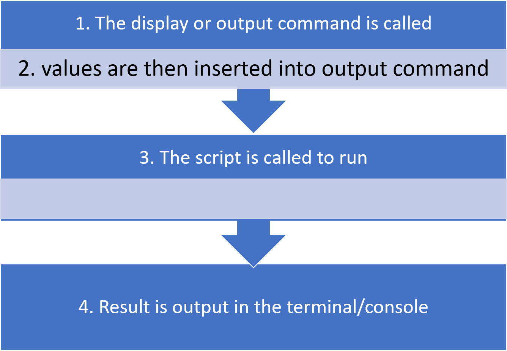

# TeamTesla - Assignment 1

This repository which contains assignment submissions for stage 1

A simple code which prints (Name, email, biostack, programming language used, slack uername )

The languages used in this assignment are all in their latest versions

## How code was written

### Values used in code include

* Member Name

* Biostack of choice

* Programming Language used

* Slack username

* Email address

### How to clone repo and generate CSV

* Fork or clone Bash script and run in shell using #$ sh teamteslabashscript.sh#
* After successful cloning, a new file will be generated in current working directory named as *teslamembersdetails.csv*
